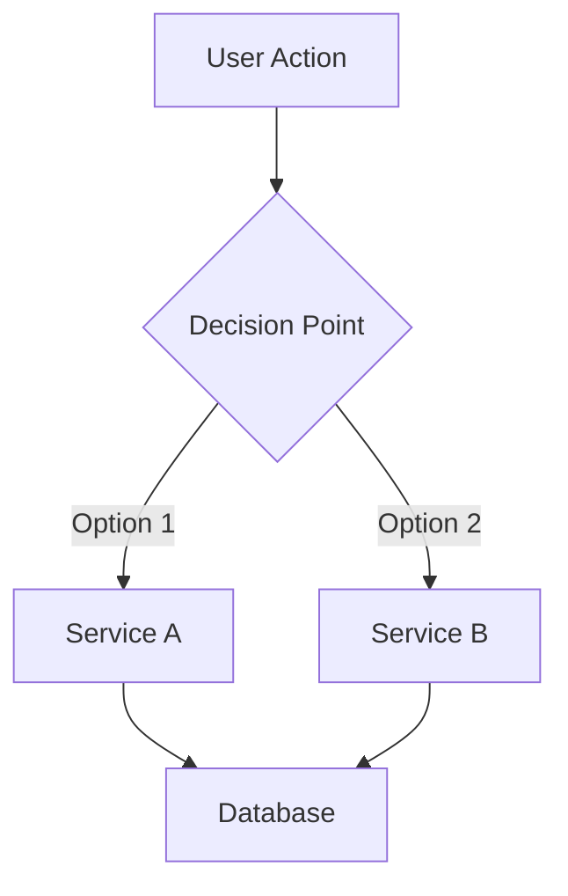

# TDD Writer

Draft Technical Design Documents for staging up large or complex projects. A TDD is a communication tool: a reader who has never seen the work should be able to read it start to finish and come away understanding **what** you're proposing, **why**, and **how** it will be built. It is not a form to fill in, and it is not a checklist with the prose removed.

**REQUIRED BACKGROUND:** Invoke `/flagrare:write-docs` before drafting. This skill owns *what a TDD must cover and how to verify it*; write-docs owns *how to make the prose readable*. The single most common failure of an AI-drafted TDD is the "medicine sheet" — every section flattened into terse bullets, no causality, nothing a human wants to read. The craft layer in write-docs is the antidote, and the section "Writing the document" below applies it specifically to TDDs. Read both; do not skip the handoff.

---

## When to Use

- Projects estimated at 2+ weeks
- Complex features with multiple components
- Architectural changes affecting multiple services
- Features requiring cross-team coordination
- User says "write a TDD", "design doc", "technical design"

---

## No Assumptions Policy

**Never assume, imply, or hallucinate ANY technical information.**

Every piece of information about architecture, code, systems, services, data models, and APIs must be:
1. Verified by reading actual source code
2. Confirmed via MCP tools (Jira, Confluence, Notion, Figma)
3. Double-checked against the actual codebase

### When Information is Unknown

Use these markers:

```
[UNKNOWN: Brief description of what's missing]
[NEEDS VERIFICATION: What needs to be checked and where]
[TBD: Decision pending - who needs to decide]
```

### Before Writing Any Technical Detail

1. **Service names** - search codebase, verify service exists
2. **API endpoints** - read actual proto files or route definitions
3. **Database tables** - find actual schema/migrations
4. **Data models** - read actual model/entity files
5. **Business logic** - read actual implementation code
6. **Dependencies** - check package.json, build.gradle, requirements.txt

---

## Workflow

### Phase 1: Gather Context

Before drafting, collect and verify information from all available sources.

**Step 1: Fetch External Context via MCP**

Jira/Linear ticket (if provided):
- Fetch full ticket details: description, acceptance criteria, linked issues
- Walk the parent chain (epic, initiative) for broader context
- Check remote links for Confluence, Figma, Notion references

Confluence/Notion docs (if referenced):
- Fetch related docs, DACIs, existing tech notes
- Search for related TDDs in the same area

Figma designs (if linked):
- Get design context, component structure
- Capture screenshots for visual reference

**Step 2: Explore Existing UI (if modifying an existing system)**

If the feature modifies an existing interface, explore the current state:
- Navigate to the relevant pages
- Document current UI layout, components, user flows
- Note current limitations and UX issues
- Identify patterns to maintain or improve

**Step 3: Analyze Codebase (required)**

Read actual code before writing technical details:
- Search for affected services, read entry points
- Find existing data models, database migrations
- Check proto files for message definitions
- Understand current architecture: API routes, service communication
- Review related code for patterns
- Find similar features for reference

**Step 4: Mark All Unknowns**

After gathering, explicitly list what could NOT be verified:
- Missing schema information
- Unclear service boundaries
- Unconfirmed business logic
- Pending decisions

### Phase 2: Draft Structure

The template below is a **coverage checklist for the author, not a layout for the reader**. It lists what a good TDD considers. It does not mean each heading gets three bullets and a code block. As you fill it, follow one rule above all others: **write each section as prose a colleague could read aloud.** Reach for a list or table only when the content is genuinely parallel and order-independent — a roster of endpoints, a t-shirt-size scale, a test matrix. The moment a "list" has bullets that depend on each other (this happens, *then* that, *because* of the other), it's a paragraph wearing a list costume. Write the paragraph.

Drop sections that don't apply rather than filling them with "N/A" noise. Mark ANY unverified information with the markers above.

```markdown
# TDD: [Initiative Title]

**Author:** [Name]
**Team:** [Team/Squad Name]
**Status:** IN REVIEW | GO | NO GO

**Links:**
- Ticket: [link]
- Designs: [link]
- Docs: [link]

---

## Introduction

### Context
[1-2 paragraphs: What problem are we solving? Business-oriented terms.]

### Problem Statement (Current State)
[Current limitations, pain points, gaps.]

### Current Flow (if modifying existing system)
[Document the existing UI and user flow.]

### Proposed Solution
[2-3 sentences: How do you plan on solving it?]

### Long Term Vision
[How does this bring us closer to the team's long-term goals?]

---

## Decision Record

- **Driver:** [Author]
- **Approver:** [EM or senior IC with domain expertise]
- **Contributors:** [Your team, affected teams]
- **Informed:** [Engineering, PM, relevant stakeholders]

---

## Phase 1

### LOE (T-Shirt Size)

| Size | Time |
|------|------|
| XS | 1-2 days |
| S | 1 week |
| M | 2 weeks |
| L | 4 weeks |
| XL | 4+ weeks |

**This phase:** [SIZE]

### External dependencies & impact

[Prose. Who else is affected and how? Name the teams that depend on this or whose
systems you touch, the vendors (with cost) you're adding, the libraries or internal
services you'll lean on — and the consequence of each. A reader should learn not just
*that* Team X is involved but *what they have to do because of this work*.]

### Concepts

[Prose. Introduce each new idea or model and, crucially, how they relate. This is
where causality lives — "an Order owns many LineItems, and a LineItem can't outlive
its Order" — so resist turning it into a glossary of disconnected terms.]

### System architecture, data model & APIs

[The technical heart. Walk the reader through the design as a story: the shape of the
data, what flows where, and the one or two decisions that everything else hangs on.
Lead with the decision and its reason, then show the artifact.

- **Data model:** Describe in prose what's changing and why, then show the actual
  schema/migration. A reader should understand the *semantics* before they read the
  column list. Reserve tables for the column inventory itself.
- **APIs:** Say what the client experiences differently and why you chose this shape,
  then include the real endpoint/proto/GraphQL definition inline (verified against
  source). A list is right for the *roster* of endpoints; prose is right for the *why*.
- **Business logic:** Explain non-trivial logic as a narrative of what happens and
  when. Number the steps only when they're a true sequence. Call out load, response,
  and caching considerations where they bite, not as a trailing bullet dump.]

### Testing

[One or two sentences on the testing strategy — what gives you confidence this is
correct — then the matrix. The table is genuinely parallel data, so a table earns its
place here.]

| Scenario | Type | Data Considerations |
|----------|------|---------------------|
| [scenario] | unit/integration/e2e/manual | [special data] |

**What won't be tested:** [Prose. State the exclusions and *why* they're acceptable.]

### Localization
[Prose, if applicable. Translation strategy and what triggers it.]

### PII
[Prose. New PII fields? PII persisted outside the primary database? Name the field and
the handling, not just "yes".]

### Observability & alerting
[Prose. What new signal will exist, and — more importantly — what question each
metric/dashboard/alert answers when something goes wrong.]

### Security
[Prose. Auth, permissions, and any vulnerability surface this opens or closes, with
the mitigation in the same breath.]

### Analytics
[Prose. New or modified events and where they land, framed by what decision the data
supports.]

### Rollout strategy
[Prose. Walk through how this reaches production — dry run, stealth mode, feature
flags, gradual percentages — as a sequence with reasons, not a checklist of toggles.
The reader should understand the *risk posture*, not just the mechanics.]

### Post-deployment monitoring
[Prose. How will we know it's working? Name the queries/dashboards and who watches
them, so a reader could verify success themselves.]

### Risks
[Prose. Each known risk paired with its mitigation in the same sentence or paragraph.
A risk listed without a mitigation reads as an unanswered worry.]

### Documentation
[Prose. What docs need to exist or change, and for whom.]

### Open questions
- [ ] [Genuinely open question — a real fork, not a placeholder]
- [ ] [Another, if any]

### Alternative solutions
[Prose. The options you considered and *why you discarded them*. This is one of the
most-read sections in any TDD — reviewers come here first to check you weren't naive —
so give each alternative a fair sentence and an honest reason it lost.]

---

## Phase 2
[If applicable]

## Future Work
[Deferred items]

---

## Verification Summary

**Sources Checked:**
- [ ] Ticket: [ticket ID]
- [ ] Docs: [page IDs]
- [ ] Codebase files read: [list files]
- [ ] API definitions: [list files]
- [ ] Database schemas: [list files]

**Information Gaps:**
- [UNKNOWN: items that could not be verified]
- [NEEDS VERIFICATION: items requiring additional review]
- [TBD: pending decisions]
```

### Phase 3: Writing the document

This is where TDDs live or die. You've gathered verified facts; now you have to turn
them into a document a busy senior engineer will actually read. The craft layer is in
`/flagrare:write-docs` — invoke it — but here is how its principles land in a TDD.

**Lead each section with the reader's situation, not the section's topic.** Compare
*"This section describes the data model changes."* (metadata — it has done zero work)
with *"Orders currently can't be partially refunded because the schema models a refund
as a single boolean. We're replacing that with a refund ledger."* The second sentence
tells the reader where they are and where you're taking them. The opening line of every
section should state a conclusion, name a problem, or ask a question.

**Prose carries causality; lists flatten it.** A TDD is mostly *because* and *so that*
and *before* — exactly the relationships a bullet list erases. When you catch yourself
writing a list whose items depend on each other, you've found a paragraph. Keep lists
for the genuinely parallel: a roster of endpoints, a t-shirt scale, a test matrix, a
checklist of sources verified. (This is the single biggest lever against the "medicine
sheet" feel the operator complained about.)

**Put context at the point of need.** The first time a reader meets `client_secret` or
`OrderProjection` or a service name, define it inline in the same sentence — not in a
glossary, not three sections up. The reader who knows skips it; the reader who doesn't
is rescued exactly where they got lost.

**Voice and tone.** Use "We will…" — conversational but precise. Be direct about scope
and limitations; a TDD that hides its gaps loses reviewer trust faster than one that
names them. Keep the voice the same throughout; let the tone tighten in the dense
technical sections and warm slightly in the context and vision.

**Diagrams.** A good diagram replaces three paragraphs of prose, so prefer Mermaid for
any non-trivial flow or architecture:



Color-code consistently — yellow/maize for existing architecture, blue for new — so a
reader can see the boundary of the change at a glance. When you show alternatives in a
diagram, mark the chosen path. Reference exact, verified file paths and show directory
layout for new components, but do it in service of the narrative, not as a standalone
inventory.

### Phase 4: Review Before Presenting

**Do not end your turn the moment the draft is assembled.** A complete-looking TDD reads as "done," but the craft pass (Phase 3 / `/flagrare:write-docs`) and this review still have to happen before you present it. Drafting and stopping is a stall — continue through review in the same turn. (Same pattern as [`docs/research/2026-06-11-claude-code-goal-anti-stall.md`](../../../../docs/research/2026-06-11-claude-code-goal-anti-stall.md).)

Run the write-docs self-check — read the document aloud; sentences that choke on the
tongue usually nominalize a verb or rely on a bullet list to carry a relationship the
prose should have carried. Then confirm:

- Could a new team member read this start to finish and understand what's proposed, why,
  and how? (If they'd have to reassemble the argument from bullets, rewrite those bullets
  as prose.)
- Is every technical claim backed by code you actually read?
- Are all unknowns marked explicitly with the markers from the No Assumptions Policy?
- Does the verification summary list every source?
- Are diagrams clear, accurate, and consistently color-coded?
- Does every section's opening sentence do work, rather than describe what the section is
  about?

Once the review passes, present the TDD and **close with a tool, not prose** — issue an `AskUserQuestion` (e.g. *Looks good / Revise a section / Mark ready for review*) so the turn ends on a clear next step rather than trailing off after a long document.

---

## Key Principles

### What to Focus On

1. **Context first** - clearly communicate the problem and intended impact
2. **Data models** - changes are hard once in production
3. **API structure** - specs that are hard to change after shipping
4. **Data loading** - network activity, especially for mobile users
5. **Novel architecture** - justify any new patterns/technologies
6. **Rollout and feedback** - how to validate success

### Data Model Best Practices

- Self-documenting: convey semantics without needing app code
- Use descriptive enums over numeric codes
- Explicit foreign keys for relationships

### API Best Practices

- Optimize ergonomics for clients
- Start from user problem, work backward to data
- Minimize client-side data transformation

---

## Anti-patterns

**Craft (the "medicine sheet"):**
- Don't flatten sections into terse bullets where prose should carry the causality. If a "list" has items that depend on each other, it's a paragraph.
- Don't open a section with metadata ("This section describes…"). Open with the reader's situation, a conclusion, or a question.
- Don't defer every definition to a glossary. Define terms inline at first use.
- Don't ship a document that can't be read start to finish. A reader should never have to reassemble your argument from disconnected bullets.

**Verification:**
- Don't invent service names that might not exist
- Don't assume API payload structures
- Don't guess database column names or types
- Don't fabricate code examples without reading actual code
- Don't assume how systems communicate without verification
- Don't skip the verification summary
- Don't present the TDD without marking gaps
