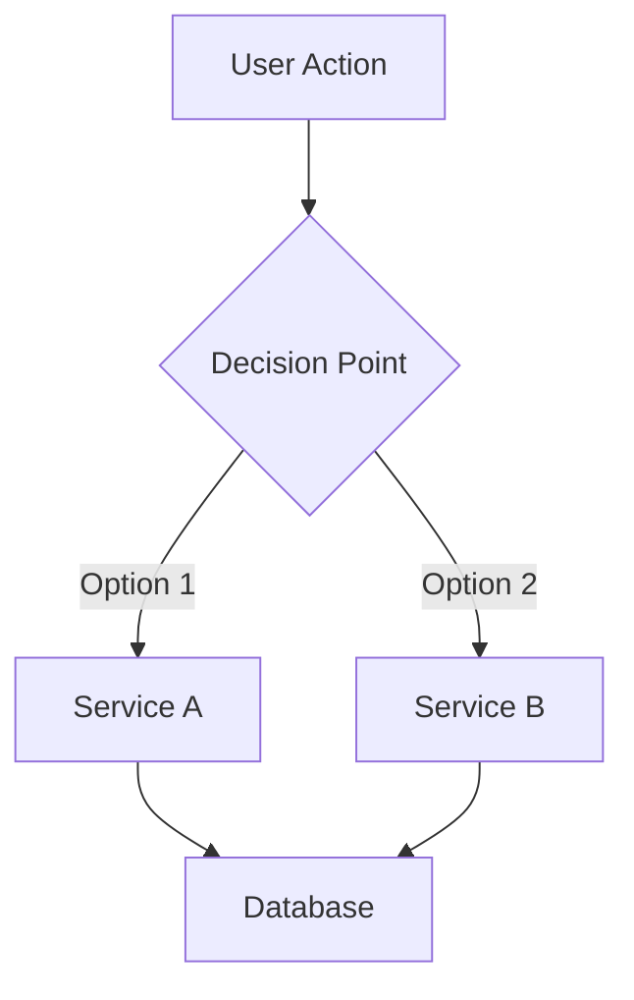

# TDD Writer

Draft Technical Design Documents for staging up large or complex projects. TDDs are communication tools for aligning stakeholders and providing high-level execution plans.

---

## When to Use

- Projects estimated at 2+ weeks
- Complex features with multiple components
- Architectural changes affecting multiple services
- Features requiring cross-team coordination
- User says "write a TDD", "design doc", "technical design"

---

## No Assumptions Policy

**Never assume, imply, or hallucinate ANY technical information.**

Every piece of information about architecture, code, systems, services, data models, and APIs must be:
1. Verified by reading actual source code
2. Confirmed via MCP tools (Jira, Confluence, Notion, Figma)
3. Double-checked against the actual codebase

### When Information is Unknown

Use these markers:

```
[UNKNOWN: Brief description of what's missing]
[NEEDS VERIFICATION: What needs to be checked and where]
[TBD: Decision pending - who needs to decide]
```

### Before Writing Any Technical Detail

1. **Service names** - search codebase, verify service exists
2. **API endpoints** - read actual proto files or route definitions
3. **Database tables** - find actual schema/migrations
4. **Data models** - read actual model/entity files
5. **Business logic** - read actual implementation code
6. **Dependencies** - check package.json, build.gradle, requirements.txt

---

## Workflow

### Phase 1: Gather Context

Before drafting, collect and verify information from all available sources.

**Step 1: Fetch External Context via MCP**

Jira/Linear ticket (if provided):
- Fetch full ticket details: description, acceptance criteria, linked issues
- Walk the parent chain (epic, initiative) for broader context
- Check remote links for Confluence, Figma, Notion references

Confluence/Notion docs (if referenced):
- Fetch related docs, DACIs, existing tech notes
- Search for related TDDs in the same area

Figma designs (if linked):
- Get design context, component structure
- Capture screenshots for visual reference

**Step 2: Explore Existing UI (if modifying an existing system)**

If the feature modifies an existing interface, explore the current state:
- Navigate to the relevant pages
- Document current UI layout, components, user flows
- Note current limitations and UX issues
- Identify patterns to maintain or improve

**Step 3: Analyze Codebase (required)**

Read actual code before writing technical details:
- Search for affected services, read entry points
- Find existing data models, database migrations
- Check proto files for message definitions
- Understand current architecture: API routes, service communication
- Review related code for patterns
- Find similar features for reference

**Step 4: Mark All Unknowns**

After gathering, explicitly list what could NOT be verified:
- Missing schema information
- Unclear service boundaries
- Unconfirmed business logic
- Pending decisions

### Phase 2: Draft Structure

Use this template. Mark ANY unverified information with the markers above.

```markdown
# TDD: [Initiative Title]

**Author:** [Name]
**Team:** [Team/Squad Name]
**Status:** IN REVIEW | GO | NO GO

**Links:**
- Ticket: [link]
- Designs: [link]
- Docs: [link]

---

## Introduction

### Context
[1-2 paragraphs: What problem are we solving? Business-oriented terms.]

### Problem Statement (Current State)
[Current limitations, pain points, gaps.]

### Current Flow (if modifying existing system)
[Document the existing UI and user flow.]

### Proposed Solution
[2-3 sentences: How do you plan on solving it?]

### Long Term Vision
[How does this bring us closer to the team's long-term goals?]

---

## Decision Record

- **Driver:** [Author]
- **Approver:** [EM or senior IC with domain expertise]
- **Contributors:** [Your team, affected teams]
- **Informed:** [Engineering, PM, relevant stakeholders]

---

## Phase 1

### LOE (T-Shirt Size)

| Size | Time |
|------|------|
| XS | 1-2 days |
| S | 1 week |
| M | 2 weeks |
| L | 4 weeks |
| XL | 4+ weeks |

**This phase:** [SIZE]

### External Dependencies / Impact

**Teams:** [Dependent teams, BI impact]
**Vendors:** [New vendors, cost analysis]
**Libraries:** [Open source, internal services]

### Concepts

[Describe each idea/model and how they relate to each other.]

### System Architecture / Data Model / API Endpoints

**Database Changes:**
- New tables? Updated tables? Migrations?
- Schema naming and structure

**API Changes:**
- New/updated endpoints, payloads
- Schema changes (GraphQL, protobuf, REST)

**Business Logic:**
- Non-trivial logic added or altered
- Response and load considerations
- Caching strategy

### Testing

| Scenario | Type | Data Considerations |
|----------|------|---------------------|
| [scenario] | unit/integration/e2e/manual | [special data] |

**What Won't Be Tested:**
[Explicit exclusions]

### Localization
[Translation strategy if applicable]

### PII
[New PII fields? PII persisted outside databases?]

### Observability and Alerting
[New metrics, dashboards, alerts]

### Security
[Auth, permissions, vulnerabilities]

### Analytics
[New/modified events, destinations]

### Rollout Strategy
- Dry run?
- Stealth mode?
- Feature flags?
- Gradual rollout percentage?

### Post-Deployment Monitoring
[How will we know it's working? Queries, dashboards, who monitors?]

### Risks
[Known risks and mitigations]

### Documentation
[New docs needed?]

### Open Questions
- [ ] Question 1?
- [ ] Question 2?

### Alternative Solutions
[Other options considered and why they were discarded]

---

## Phase 2
[If applicable]

## Future Work
[Deferred items]

---

## Verification Summary

**Sources Checked:**
- [ ] Ticket: [ticket ID]
- [ ] Docs: [page IDs]
- [ ] Codebase files read: [list files]
- [ ] API definitions: [list files]
- [ ] Database schemas: [list files]

**Information Gaps:**
- [UNKNOWN: items that could not be verified]
- [NEEDS VERIFICATION: items requiring additional review]
- [TBD: pending decisions]
```

### Phase 3: Writing Style

**Voice:**
- Use "We will..." language (conversational but precise)
- Be direct about scope and limitations

**Diagrams:**
Always use Mermaid for flowcharts and graphs when possible:



Use color coding:
- Yellow/Maize: existing architecture
- Blue: new architecture

**Structure patterns:**
- List entry points with subscripts matching diagrams
- Show both alternatives and mark the chosen one
- Reference exact file paths
- Show directory layout for new components
- Document UI states with conditions
- Use numbered steps for complex business logic flows
- Include full proto/schema definitions inline

### Phase 4: Review Before Presenting

Before presenting the TDD:
- Is every technical claim backed by code you actually read?
- Are all unknowns marked explicitly?
- Does the verification summary list every source?
- Are diagrams clear and accurate?
- Could a new team member follow this document?

---

## Key Principles

### What to Focus On

1. **Context first** - clearly communicate the problem and intended impact
2. **Data models** - changes are hard once in production
3. **API structure** - specs that are hard to change after shipping
4. **Data loading** - network activity, especially for mobile users
5. **Novel architecture** - justify any new patterns/technologies
6. **Rollout and feedback** - how to validate success

### Data Model Best Practices

- Self-documenting: convey semantics without needing app code
- Use descriptive enums over numeric codes
- Explicit foreign keys for relationships

### API Best Practices

- Optimize ergonomics for clients
- Start from user problem, work backward to data
- Minimize client-side data transformation

---

## Anti-patterns

- Don't invent service names that might not exist
- Don't assume API payload structures
- Don't guess database column names or types
- Don't fabricate code examples without reading actual code
- Don't assume how systems communicate without verification
- Don't skip the verification summary
- Don't present the TDD without marking gaps
